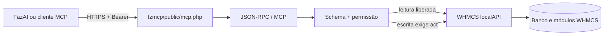

# fzWHMCS MCP AI

Servidor MCP integrado ao WHMCS para conectar o FazAI e outros clientes
compatíveis à operação de billing com autenticação, schemas e permissões por
ferramenta.

> **Estado:** ativo no WHMCS de produção · módulo `fzmcp` · versão `1.0.1` ·
> ferramentas de escrita bloqueadas por padrão

## O que este repositório contém

| Caminho | Estado | Responsabilidade |
|---|---|---|
| [`fzmcp/`](fzmcp/) | Ativo | Addon WHMCS que implementa MCP por HTTP/SSE/stdio e chama `localAPI()` |
| [`imovelsite/`](imovelsite/) | Histórico | Primeira geração do provisionador; a fonte produtiva atual é `RLuf/imovelsite-whmcs-module` |
| [`docs/`](docs/) | Ativo | Instalação, operação, upgrade e diagnóstico |

Não implante o provisionador de `imovelsite/` sobre a Plataforma ImovelSite 2.0.
Ele permanece somente como histórico técnico.

## Arquitetura



O endpoint externo autentica com Bearer token. O token bruto é entregue uma vez
ao cliente; o WHMCS guarda somente seu hash. Dentro do WHMCS, o addon usa
`localAPI()` com um administrador configurado — não precisa nem deve armazenar
senha administrativa.

## Capacidades

- MCP Streamable HTTP, SSE legado e stdio;
- JSON-RPC 2.0 e negociação de protocolo;
- catálogo estático com schemas de entrada;
- permissões `disabled`, `read` e `act`;
- token Bearer com hash em repouso;
- validação de origem, HTTPS e logs sanitizados;
- painel administrativo para token, permissões e teste de ferramentas;
- autoteste offline/live seguro.

Na versão atual, o catálogo exposto possui 86 ferramentas:

| Tipo | Quantidade | Padrão |
|---|---:|---|
| Leitura | 38 | Permitida conforme nível `read` |
| Escrita | 48 | Bloqueada até o operador selecionar `act` |

## Início rápido

### Instalar no WHMCS

```bash
cp -a fzmcp /CAMINHO_WHMCS/modules/addons/fzmcp
```

Depois:

1. Abra **Configurações → Módulos Addon**.
2. Ative **fzWHMCS-MCP-AI**.
3. Libere o grupo administrativo autorizado.
4. Configure **Usuário Admin da API**, transporte HTTP e origens.
5. Em **Addons → fzWHMCS-MCP-AI**, gere o token e revise as permissões.

### Conectar o FazAI

```env
MCP_WHMCS_URL=https://SEU-WHMCS/modules/addons/fzmcp/public/mcp.php
MCP_WHMCS_AUTH=Bearer:TOKEN_BRUTO_GERADO
```

O header enviado é:

```http
Authorization: Bearer TOKEN_BRUTO_GERADO
```

`Bearer:` no arquivo de configuração é o formato do FazAI; no protocolo HTTP,
o separador entre o esquema e o token é um espaço.

Se o token original foi perdido, gere outro no painel e atualize o cliente. O
hash armazenado não permite recuperar o token anterior.

## Testes

No ambiente WHMCS, use a CLI PHP compatível com sua instalação:

```bash
cd /CAMINHO_WHMCS/modules/addons/fzmcp
/CAMINHO/PHP-COMPATIVEL bin/selftest.php
```

Resultado de referência da versão `1.0.1`: 101 verificações aprovadas, 38
leituras despachadas e 48 escritas recusadas enquanto não liberadas.

## Documentação

| Documento | Conteúdo |
|---|---|
| [Índice](docs/README.md) | Mapa completo da documentação |
| [Instalação](docs/INSTALL.md) | Requisitos e instalação |
| [Operação](docs/OPERACAO.md) | Token, permissões, testes e rotina |
| [Upgrade do WHMCS](docs/WHMCS-UPGRADE.md) | Compatibilidade, migração e rollback |
| [Troubleshooting](docs/TROUBLESHOOTING.md) | Diagnóstico por sintoma |
| [Reinstalação](docs/PROMPT-REINSTALACAO.md) | Procedimento assistido |
| [Instruções para agentes](AGENTS.md) | Regras de manutenção e segurança |

## Relação com os outros projetos

- `RLuf/imovelsite-whmcs-module`: provisionamento produtivo do produto 177.
- `RLuf/fzwordpress-mcp-ai`: MCP multi-site dos WordPress.
- `RLuf/fzwhmcs-ai`: produto MCP mais amplo, com cliente npm e site; não é a
  fonte da instalação atual sem uma migração homologada.
- `RLuf/whmcs-addon-template`: base para novos addons comercializáveis.

## Licença

Proprietário — Webstorage do Brasil. Uso interno.
